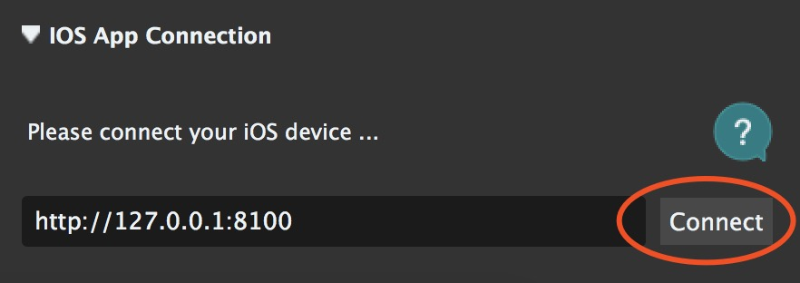

iOS-Tagent 介绍
=======================
iOS-Tagent 是基于 facebook 的 [WebDriverAgent](https://github.com/facebook/WebDriverAgent) 项目上进行开发的 , 目的是为了对 [Airtest Project](http://airtest.netease.com/) 提供iOS平台的测试支持，我们在原项目的基础上进行了定制化的优化和功能调整。

这个项目在如下版本上进行了开发和测试：

| iOS       	| Xcode 	|
|-----------	|-------	|
|  ≥ 13             | 11.x      |
| 10.x-12.x 	| 10.x  	|
| ≥ 9.3       	| ≥ 9.3   	|

其他版本的Xcode和iOS未经完整测试，可能会出现非预期的错误情况。


# Airtest部署iOS平台测试
在IOS平台进行Airtest测试，需要进行如下部署。

## 1. iOS-Tagent
在手机上创建一个WebDriver服务器，可用于远程控制iOS设备，定位UI元素


* 1.1 下载 iOS-Tagent 到本地电脑

    >git clone git@github.com:AirtestProject/iOS-Tagent.git

* 1.2 使用Xcode打开 iOS-Tagent, 用数据线连接iPhone至Mac

    >选择项目，在菜单栏 `product` -> `Scheme` -> `WebDriverAgentRunner` 

    >选择设备，在菜单栏 `product` -> `Destination` -> 选择你的真机 

    

* 1.3 启动Test，在菜单栏 `product` -> `Test`。当你看到这样的日志的时候，代表 iOS-Tagent 已经启动成功了
```
    Test Suite 'All tests' started at 2017-01-23 15:49:12.585
    Test Suite 'WebDriverAgentRunner.xctest' started at 2017-01-23 15:49:12.586
    Test Suite 'UITestingUITests' started at 2017-01-23 15:49:12.587
    Test Case '-[UITestingUITests testRunner]' started.
    t =     0.00s     Start Test at 2017-01-23 15:49:12.588
    t =     0.00s     Set Up
```

    可以从以下了解更多的关于如何成功启动这个项目的方法 [here](https://github.com/facebook/WebDriverAgent/wiki/Starting-WebDriverAgent).和 [here](https://github.com/appium/appium/blob/master/docs/en/drivers/ios-xcuitest-real-devices.md)


## 2. 设置代理
[iproxy](https://github.com/libimobiledevice/libimobiledevice) 可以把iPhone端口映射到电脑端口，那么就可以通过访问电脑的端口访问到手机的端口了。

一般情况下，需要通过设置usb代理的方式访问手机上的Agent，直接通过wifi对手机进行访问可能会出现问题，具体的原因可以参考 [Issues](https://github.com/facebook/WebDriverAgent/wiki/Common-Issues) 和 [detail](https://github.com/facebook/WebDriverAgent/issues/288)


* 2.1 通过 Homebrew 安装iproxy

    `$ brew install libimobiledevice`

* 2.2 运行iproxy

    `$ iproxy 8100 8100`


启动成功后，可以试着在浏览器访问 http://127.0.0.1:8100/status ，如果访问成功并且可以看到一些json格式的手机信息，即表示启动成功。此时，访问 http://127.0.0.1:8100/inspector 可以看到iPhone屏幕投影在浏览器上


有一点需要 **注意** 的，iproxy只能监听localhost，所以如果你想使用 Windows 连接iPhone，可以改用 [wdaproxy](https://github.com/openatx/wdaproxy)。具体步骤为：

* 使用usb数据线连接iPhone至Mac
* 在Mac上运行 wdaproxy，wdaproxy可以把iPhone端口映射到Mac端口，具体安装运行步骤可参考 https://github.com/openatx/wdaproxy 
* 在Windows上的AirtestIDE iOS地址输入框，输入Mac的ip地址和端口，点击"connect"按钮


## 3. AirtestIDE

通过ip方式连接iPhone，实时刷新界面，可进行UI测试

完成上面两个步骤后，就可以在AirtestIDE的iOS地址栏填入地址 http://127.0.0.1:8100 ，点击 “connect” 连接设备，开始编写你的Airtest测试脚本了





# Q & A
我们猜测你在部署过程中会遇到很多问题，所以整理了一份 [Q&A](./question_zh.md)，你可以先看看，如果对于这个项目有问题和反馈建议，也欢迎到 [Issues](https://github.com/AirtestProject/iOS-Tagent/issues)里进行提出.
1. [Xcode版本问题](./question_zh.md#xcode版本)
1. [申请开发者证书](./question_zh.md#开发者证书)
1. [登陆开发者账号](./question_zh.md#登陆开发者账号)
1. [设置开发者证书](./question_zh.md#设置开发者证书)
1. [Xcode failed to create provisioning profile](./question_zh.md#buddle-identifier)
1. [第一次安装，信任设备](./question_zh.md#信任设备)


# License
iOS-Tagent 基于[WebDriverAgent](https://github.com/facebook/WebDriverAgent) 进行了定制化的开发和优化:


[`WebDriverAgent` is BSD-licensed](LICENSE). We also provide an additional [patent grant](PATENTS).


Have fun with Airtest!
