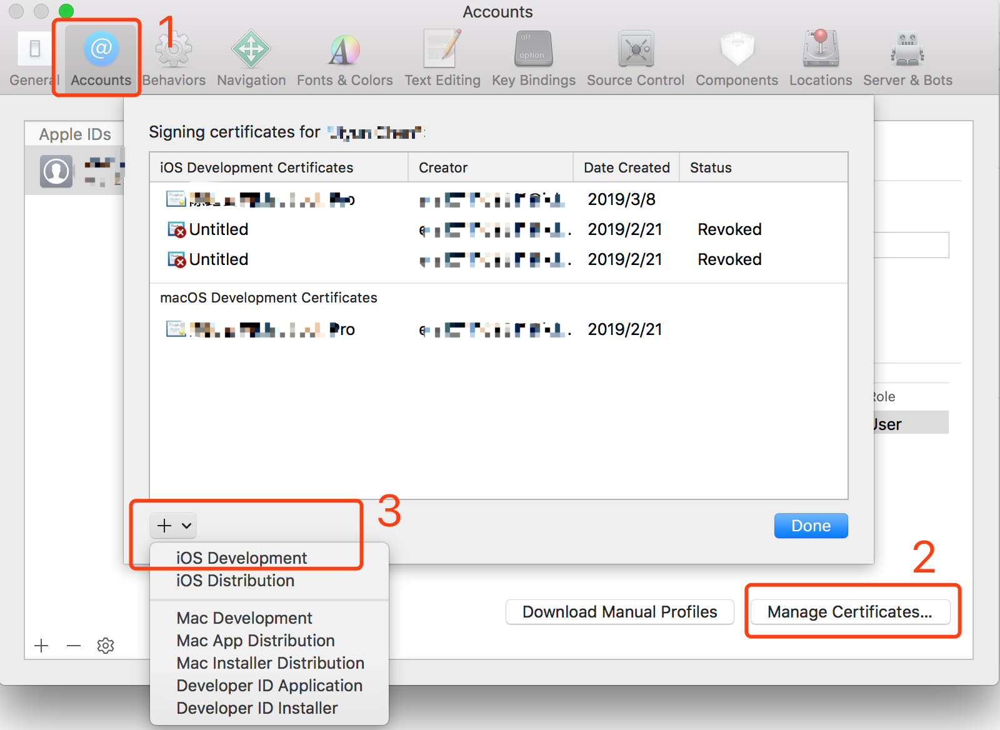
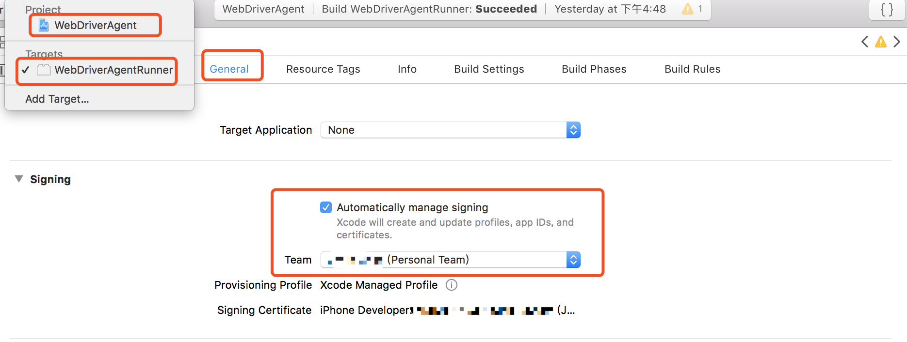
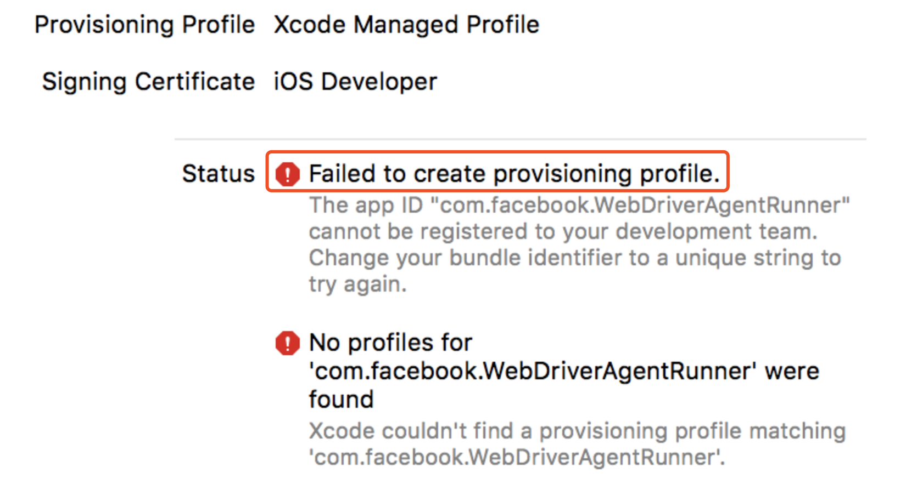

# Q & A

## Xcode version

Different versions of Xcode need to be installed under specific Mac OS versions and can develop specific iOS versions. For more details, refer to [Wikipedia](https://en.wikipedia.org/wiki/Xcode).


High version Xcode can't be installed on macOS with a lower version. 
If you try to install Xcode by downloading Xcode.zip, you could then see errors like `cpio read error:Undefined error:0` when decompressing.


## iOS Developer Account
Apple Developer Certificate is required to deploy iOS-Tagent. Fortunately, Apple now allows us to register with Apple ID without payment.  
The free certificate of the personal version needs to be manually updated every 7 days;  
Need to manually select the trust certificate in iPhone, General-> Device Management-> Trust;  
Support up to 3 devices;  
~~If you are well-funded and plan to focus on iOS, you can apply for an Apple developer account to avoid some other anomalies~~

## Login to Xcode
Select `Xcode` -> `Preferences` -> `Accounts` -> `Manage Certificates` -> below the left column `+` -> `iOS Development` to login Xcode.




## Manage developer certificate
After login, you need set up the developer certificate. `WebDriverAgent` -> `WebDriverAgent-Runner` -> `General` -> `Signing` select your certificate




## bundle identifier
If you are using a free developer certificate, you may see the error `Xcode failed to create provisioning profile` 



This error can be fixed by changing the Bundle Identifier `Build Settings` -> `Product Bundle Identifier`. This should be a unique identifier, you can set up your own.Here's an example 'com.xxx.webDriverAgent-test123'. 


## Trusting certificates
The first time you install iOS-Tangent to your iPhone, you will get a pop up as shown below.  Select Settings
The first time you installed iOS-Tagent to your iPhone, you will get a pop up as shown below. Select `Settings ` -> `General ` -> `Device Management`  ->  to trust the developer certificate on your iPhone. Then retry "test" in Xcode, it should work. See [Apple documentation](https://support.apple.com/en-us/HT204460)


## Error and Solutions

### The number of personal free certificate devices exceeds the limit

A free certificate can sign up to 3 devices. If it is exceeded, the error prompt will be as follows:  


Solution: You can apply for a new personal free Apple account and re-operate

### Failed to load the software package

When running the Test file, the console outputs the following log and reports an error  


Solution: Manually delete the "WebDriverAgentRunner" package previously built in the phone and run it again  


### Did not agree to the Apple agreement

The developer account registers a new device, and an error message pops up:  

```
 This request is forbidden for security reasons You currently don't have access to this membership resource. To resolve this issue, agree to the latest Program License Agreement in your developer account.
```

Solution: Log in to the Apple Developer Account Center, agree to the pop-up agreement, and then return to Xcode to register the device.  