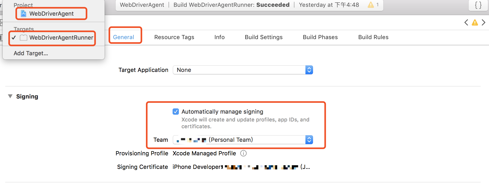
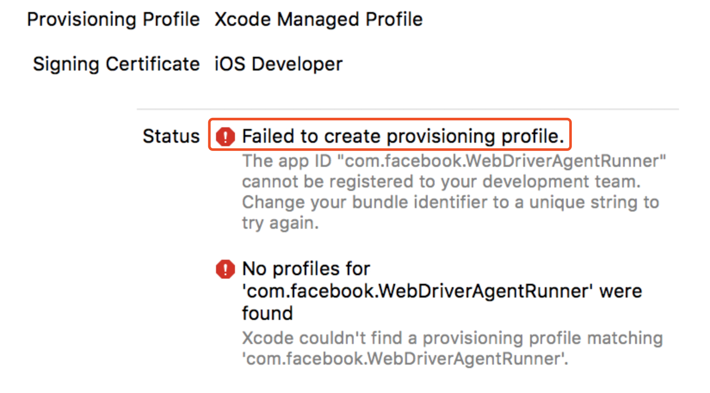

# Q & A

## Xcode版本
不同版本的Xcode需要在指定版本的mac os系统下安装，能开发指定版本的iOS，具体可参考[维基百科](https://en.wikipedia.org/wiki/Xcode)


高版本 Xcode 不能在低版本 macOS 下安装，强行下载 xip 安装包进行安装，在解压的时候也会出现如下问题。如出现如`cpio read error:Undefined error:0` 、  `应用程序Xcode的这个版本不能与此版本的OS X配合使用`等问题，最好还是更新 os 系统或者更换低版本Xcode


## 开发者证书
部署iOS测试平台需要苹果开发者证书，现在使用个人Apple ID登陆即可，不需要另外注册付费开发者账号  
个人版的免费证书，每隔7天左右，要手动更新开发者证书；  
需要手动的在iPhone中选择信任证书，通用->设备管理->选择信任；  
最多支持3台设备；  
~~资金富裕、且准备重点学习iOS的，可以申请苹果开发者账号，可规避一些其他异常~~


## 登陆开发者账号
开发者账号登陆过程为 `Xcode` -> `Preferences` -> `Accounts` -> `Manage Certificates` -> 左栏下方 `+` -> `iOS Development`，如有遇到其他问题，可自行百度


## 设置开发者证书
登陆后，需在项目设置开发者证书，具体步骤为`WebDriverAgent` -> `WebDriverAgent-Runner` -> `General` -> `Signing` 选择自己的开发者证书




## buddle identifier
使用了免费开发者证书的用户，可能会遇到问题 `Xcode failed to create provisioning profile` 



可以通过修改 `Build Settings` -> `Product Bundle Identifier`解决。Xcode会联网检查Product Bundle Identifier，此字段要求唯一标志，多试几个，总有可以的。如 ('com.xxx.webDriverAgent-test123')


## 信任设备
第一次安装 iOS-Tagent 的时候，你会遇到下面的错误提示框。这时候需要信任应用程序才可以进行启动，在手机上 `设置` -> `通用` -> `设备管理` 从而对应用程序进行信任，才可以进行运行 (可以查看 [Apple documentation](https://support.apple.com/en-us/HT204460))。之后 Xcode 重新启动`test`即可，会黑屏一下接着正常执行。


## 常见异常及解决办法

### 个人免费证书签注设备数超限

一个免费的证书最多可签注3台设备，超过会错误提示如下：  


解决：可申请新的个人免费苹果账号，重新操作

### 未能载入软件包

在运行Test文件时，控制台输出如下日志，并报错


解决：手动删除手机中之前Build过的”WebDriverAgentRunner“包体，再次运行


### 未同意苹果协议

开发者账号注册新设备，弹出错误提示：  

```
 This request is forbidden for security reasons You currently don't have access to this membership resource. To resolve this issue, agree to the latest Program License Agreement in your developer account.
```

解决：登录苹果开发者账号中心，同意弹出的协议后，在回到Xcode中，注册设备。

### Mac网络波动或不稳定

运行着的“WebDriverAgent”会出现掉线异常  
解决：
网络稳定后，重新运行

### 出现异常，其他可尝试的操作

1、Git pull更新到最新的代码  
2、在菜单栏 `product` -> `Clean Build Folder`，清理之前的工作目录  
3、重新插拔iPhone  
4、卸载iPhone上的“WebDriverAgent”包体  
5、重启iPhone  
6、重启Mac  