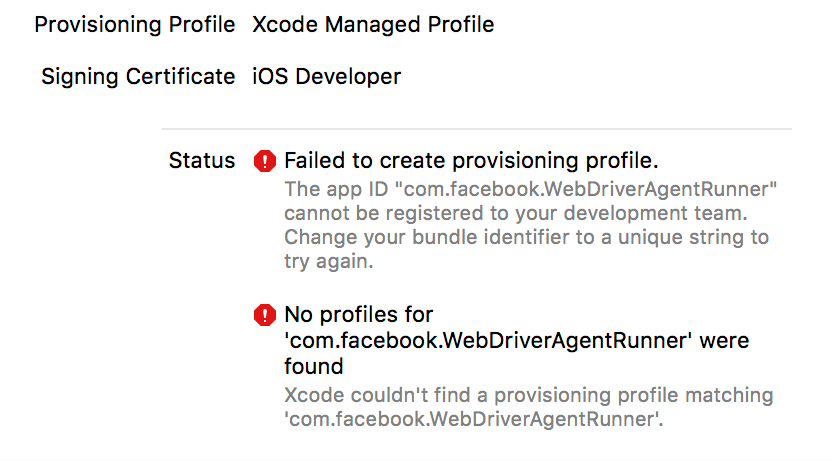
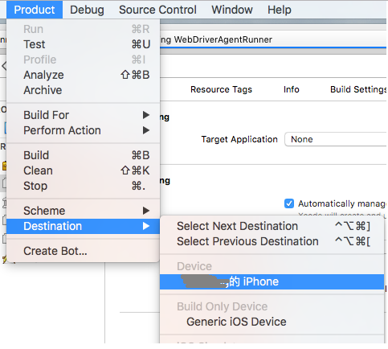
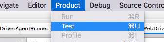

iOS-Tagent Introduction
=======================

iOS-Tagent is a project based on facebook [WebDriverAgent](https://github.com/facebook/WebDriverAgent) and intend to fit [Airtest Project](http://airtest.netease.com/).

[中文文档](./README_zh.md)

To use Airtest and AirtestIDE on iOS, this project is required.

This Project is worked well in:

| iOS       	| Xcode 	|
|-----------	|-------	|
| 10.x-12.x 	| 10.x  	|
| 9.x       	| 9.x   	|

Other version of xcode and iOS version is not fully tested
if you have problem with this project please goto [issues](<https://github.com/AirtestProject/iOS-Tagent/issues>)

API status
----------

This project intend to work with
[AirtestIDE](http://airtest.netease.com/) and [AirtestFramework](https://github.com/AirtestProject/Airtest)

Common API in Airtest is supported

> -   start\_app: OK
> -   stop\_app: OK
> -   snapshot: OK
> -   home: OK
> -   touch: OK
> -   swipe: OK
> -   text: OK
> -   wait: OK
> -   exists: OK
> -   find\_all: OK
> -   assert\_exists: OK
> -   assert\_not\_exists: OK

except:

> -   wake: Not supported now (may use 'home' instead)
> -   keyevent: Only support 'home' event
> -   clear\_app: Not supported now
> -   install: Not supported now
> -   uninstall: Not supported now

Fast Hierarchy view
-------------------

Now it can view device Hierarchy really fast

This feature work with [Poco](https://github.com/AirtestProject/Poco) and AirtestIDE.

Getting Started
---------------

### prerequisite

1. iOS Provisioning Profile(Certificate) (free or paid)
2. basic experience with xcode

You can simply open WebDriverAgent.xcodeproj and start WebDriverAgentRunner to test

and start do what you want with [Airtest](http://airtest.netease.com/) (with iOS http url)

Start manual
------------

### 1. run the agent

1.1  set up an signing in WebDriverAgent -> WebDriverAgent-Runner-> General -> signing.   

1.2  if a free personal certificate used

    > This will manifest as something like an error that Xcode failed to
    > create provisioning profile:
    >
    > 
    >
    > please change 'Build Settings' ->"Product Bundle Identifier" into
    > somethings else. like 'com.xxx.webDriverAgent-test123'
    >
    > 

### 2. perform test in a selected device

2.1 choose device first

2.2 choose schema next

2.3 finally: Product -> Test

or

2.4 also you need trust the application. You can go to Settings => General => Device Management on the device to trust the developer and allow the app to be run (see [Apple documentation for mor information](https://support.apple.com/en-us/HT204460) ) after that run 'test' again

2.5 start success

    > when something like this show in log, it means webDricerAgent
    > start success :
    >
    >     Test Suite 'All tests' started at 2017-01-23 15:49:12.585
    >     Test Suite 'WebDriverAgentRunner.xctest' started at 2017-01-23 15:49:12.586
    >     Test Suite 'UITestingUITests' started at 2017-01-23 15:49:12.587
    >     Test Case '-[UITestingUITests testRunner]' started.
    >     t =     0.00s     Start Test at 2017-01-23 15:49:12.588
    >     t =     0.00s     Set Up

More about how to start WebDriverAgent [here](https://github.com/facebook/WebDriverAgent/wiki/Starting-WebDriverAgent) and [another](https://github.com/appium/appium/blob/master/docs/en/drivers/ios-xcuitest-real-devices.md)

### 3. Set up proxy

You need to set up proxy to forward request to real device via usb-forwarding as this may have something wrong, known [Issues](https://github.com/facebook/WebDriverAgent/wiki/Common-Issues) and [detail](https://github.com/facebook/WebDriverAgent/issues/288)

You can use [iproxy](https://github.com/libimobiledevice/libimobiledevice)

    $ brew install libimobiledevice
    $ iproxy 8100 8100

Then try to access <http://127.0.0.1:8100/status> in mac browser, is a json string shown, mean all start success

### 4. Finally

You can use iOS device in airtest with <http://127.0.0.1:8100>

Known Issues
------------

<https://github.com/AirtestProject/iOS-Tagent/issues>

License
-------

This project is based on [WebDriverAgent](https://github.com/facebook/WebDriverAgent) :

[**WebDriverAgent** is BSD-licensed](./LICENSE) . We also provide an additional [patent grant](./PATENTS).

Have fun with Airtest!
