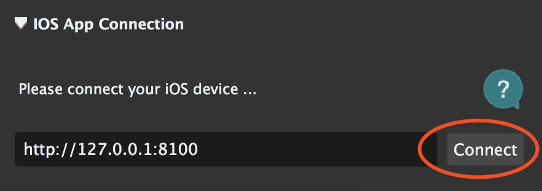

iOS-Tagent Introduction
=======================

iOS-Tagent is a project based on facebook [WebDriverAgent](https://github.com/facebook/WebDriverAgent) and intend to fit [Airtest Project](http://airtest.netease.com/).


We make some customized optimization and adjustments to it and it works well in:

| iOS       	| Xcode 	|
|-----------	|-------	|
| 10.x-12.x 	| 10.x  	|
| ≥ 9.3       	| ≥ 9.3   	|

Other versions of Xcode and iOS are not fully tested and may cause unexpected errors.


If you need README in Chinese, click here([如需中文文档，请点击这里](./Introduction/README_zh.md))


# Getting Started

To perform Airtest in iOS, the following steps are required

## 1. iOS-Tagent
Create a WebDriver server on your iPhone which makes it possible to remote control iOS devices and locate UI elements.

* 1.1 Clone or Download iOS-Tagent

    > git clone git@github.com:AirtestProject/iOS-Tagent.git

* 1.2 Open iOS-Tagent with Xcode and connect your iPhone to Mac with a data cable

    > Select `product` -> `Scheme` -> `WebDriverAgentRunner` in the top menu of Xcode

    > Then select `product` -> `Destination` -> your iPhone

    

* 1.3 Start tests by click `product` -> `Test`. When something like this shows in the log, it means that iOS-Tagent have started successfully.

```
    Test Suite 'All tests' started at 2017-01-23 15:49:12.585
    Test Suite 'WebDriverAgentRunner.xctest' started at 2017-01-23 15:49:12.586
    Test Suite 'UITestingUITests' started at 2017-01-23 15:49:12.587
    Test Case '-[UITestingUITests testRunner]' started.
    t =     0.00s     Start Test at 2017-01-23 15:49:12.588
    t =     0.00s     Set Up
```

More about how to start WebDriverAgent [here](https://github.com/facebook/WebDriverAgent/wiki/Starting-WebDriverAgent) and [here](https://github.com/appium/appium/blob/master/docs/en/drivers/ios-xcuitest-real-devices.md)

## 2. Set up proxy

iproxy maps the iPhone port to the Mac port, so you can access the phone by accessing the Mac. 

You need to set up the usb proxy to access the Agent on the actual phone, as there may be problems when accessing directly through wifi. For more information, check  [Issues](https://github.com/facebook/WebDriverAgent/wiki/Common-Issues) and [detail](https://github.com/facebook/WebDriverAgent/issues/288)

The original source code of iproxy is shown in https://github.com/libimobiledevice/libimobiledevice

* 2.1 Install iproxy with Homebrew

    `$ brew install libimobiledevice`

* 2.2 Run iproxy

    `$ iproxy 8100 8100`

Then try to access http://127.0.0.1:8100/status in your mac browser. If a json data about your iPhone is returned, it means iproxy started successfully. Moreover, you can see iPhone screen projected on the browser by visiting http://127.0.0.1:8100/inspector .

**Note** that iproxy can only listen to localhost. If you want to connect iPhone on AirtestIDE on a windows OS, you can try [wdaproxy](https://github.com/openatx/wdaproxy). The specific steps are as follows:

* Connect iPhone to Mac with a usb cable.
* Run wdaproxy in Mac. wdaproxy can map the iPhone port to the Mac port too. You can see the installation instruction in https://github.com/openatx/wdaproxy .
* Fill ip address and port of the iPhone (retrieved in the previous step) in the input box of AirtestIDE on Windows and click button "connect".

## 3. AirtestIDE

Connect to the iPhone by ip address, refresh screen, run tests

After the above two steps, you can fill "http://127.0.0.1:8100" in the iOS address input box of AirtestIDE. Click button "connect" to connect your iPhone and start your Airtest test.




Note that you can also view the device Hierarchy

This feature work with [Poco](https://github.com/AirtestProject/Poco) and AirtestIDE.

# Q & A

We have collected a series of common issues on our [Q&A](./Introduction/question.md). If you have any questions, please take a look at these first. 
If you can't find your issue here, or you have any suggestion, please feel free to post it in [Issues](https://github.com/AirtestProject/iOS-Tagent/issues).


1. [Xcode version](./Introduction/question.md#xcode-version)
1. [iOS Developer Account](./Introduction/question.md#ios-developer-account)
1. [Login to Xcode](./Introduction/question.md#login-to-xcode)
1. [Manage developer certificate](./Introduction/question.md#manage-developer-certificate)
1. [Xcode failed to create provisioning profile](./Introduction/question.md#bundle-identifier)
1. [Trust certificate](./Introduction/question.md#trusting-certificates)


# API status

This project intend to work with
[AirtestIDE](http://airtest.netease.com/) and [AirtestFramework](https://github.com/AirtestProject/Airtest)

Common API in Airtest is supported

> -   start\_app: OK
> -   stop\_app: OK
> -   snapshot: OK
> -   home: OK
> -   touch: OK
> -   swipe: OK
> -   text: OK
> -   wait: OK
> -   exists: OK
> -   find\_all: OK
> -   assert\_exists: OK
> -   assert\_not\_exists: OK

except:

> -   wake: Not supported now (may use 'home' instead)
> -   keyevent: Only support 'home' event
> -   clear\_app: Not supported now
> -   install: Not supported now
> -   uninstall: Not supported now


# License

This project is based on [WebDriverAgent](https://github.com/facebook/WebDriverAgent) :

[**WebDriverAgent** is BSD-licensed](./LICENSE) . We also provide an additional [patent grant](./PATENTS).

Have fun with Airtest!